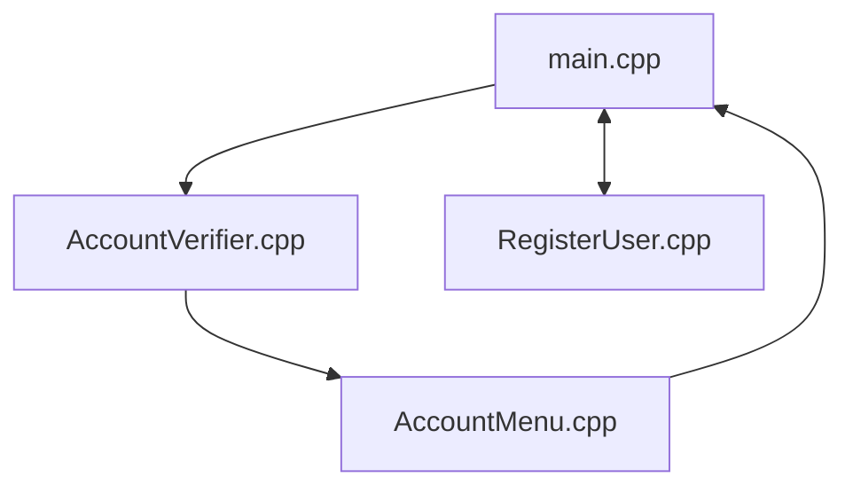

# ATM Project

### Version 1.0

## Created by Steven Fisher

Feel free to provide constructive criticism, and feedback as this is my attempt at an ATM project I've made in C++.

Functions I'll be adding to this project in the future:

-Create, connect, and store information on a database created just for this project instead of .txt files.

-Encrypt username, passwords, and account information.

Diagram of program below:

